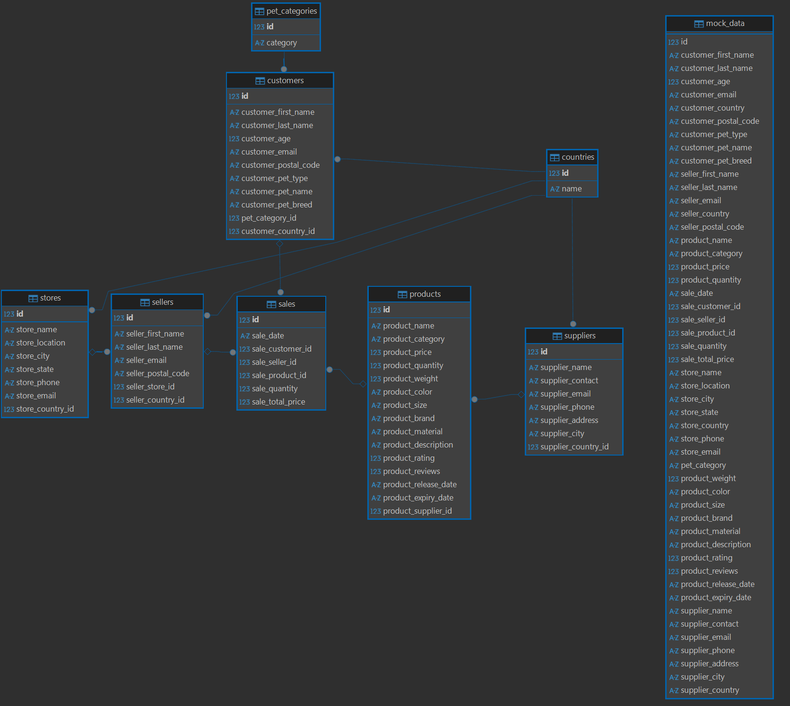

# BigDataSnowflake

## Запуск
1. Запустить контейнер через docker-compose up;
2. Создать соединение в DBeaver по localhost:5433 с логином: <i>postgres</i> и паролем: <i>admin</i>;

## ER-диаграмма снежинки

